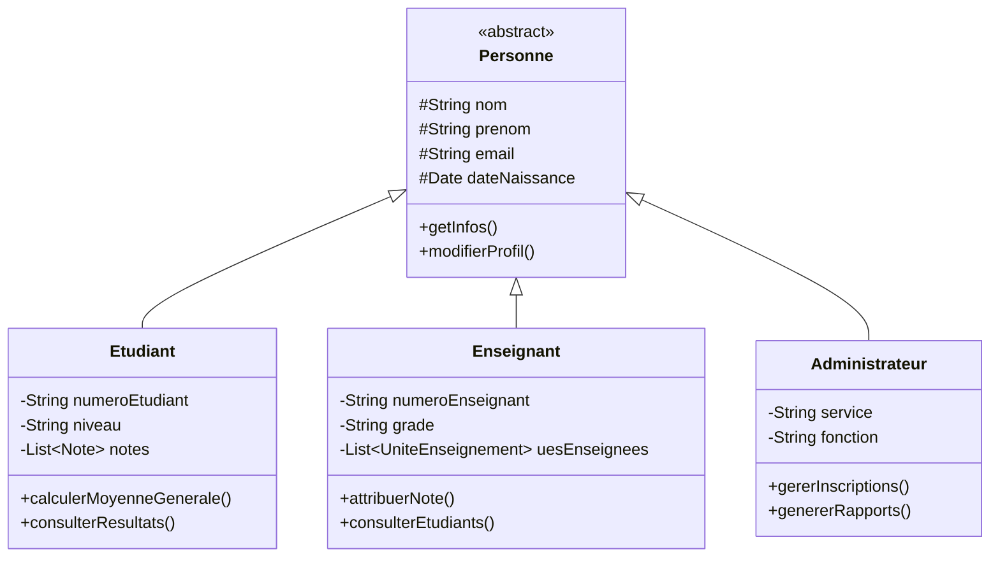

### Diagramme simplifié avec héritage

```mermaid
classDiagram
    class Personne {
        <<abstract>>
        #String nom
        #String prenom
        #String email
        #Date dateNaissance
        +getInfos()
        +modifierProfil()
    }
    
    class Etudiant {
        -String numeroEtudiant
        -String niveau
        -List~Note~ notes
        +calculerMoyenneGenerale()
        +consulterResultats()
    }
    
    class Enseignant {
        -String numeroEnseignant
        -String grade
        -List~UniteEnseignement~ uesEnseignees
        +attribuerNote()
        +consulterEtudiants()
    }
    
    class Administrateur {
        -String service
        -String fonction
        +gererInscriptions()
        +genererRapports()
    }
    
    Personne <|-- Etudiant
    Personne <|-- Enseignant  
    Personne <|-- Administrateur
```