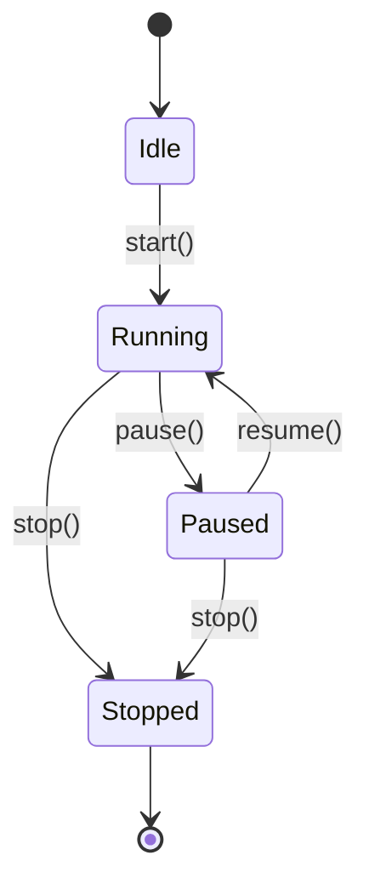

## Diagrammes d'état

```mermaid
stateDiagram-v2
    [*] --> Idle
    Idle --> Running : start()
    Running --> Paused : pause()
    Paused --> Running : resume()
    Running --> Stopped : stop()
    Paused --> Stopped : stop()
    Stopped --> [*]
```