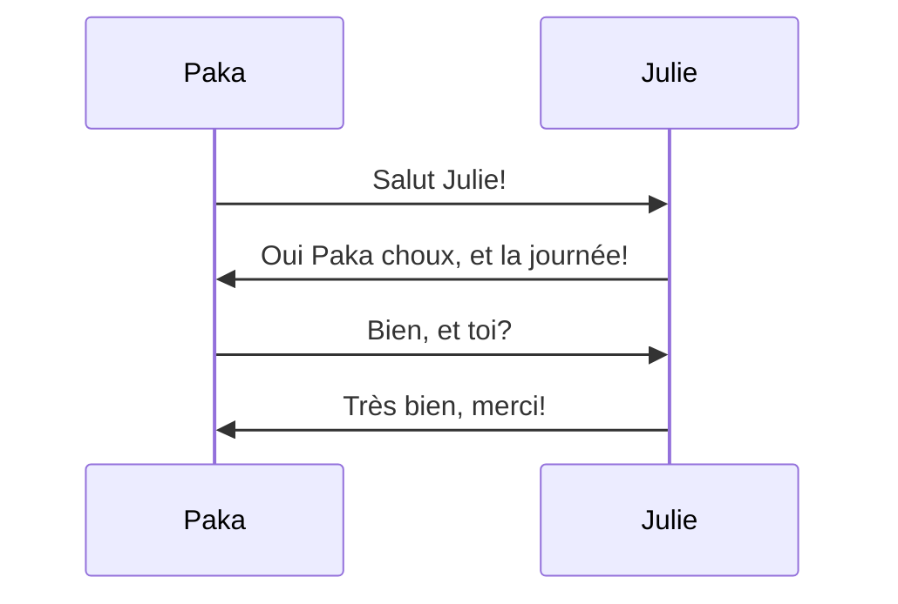

### Diagramme de séquence

```mermaid
sequenceDiagram
    participant A as Paka
    participant B as Julie
    A->>B: Salut Julie!
    B->>A: Oui Paka choux, et la journée!
    A->>B: Bien, et toi?
    B->>A: Très bien, merci!
```